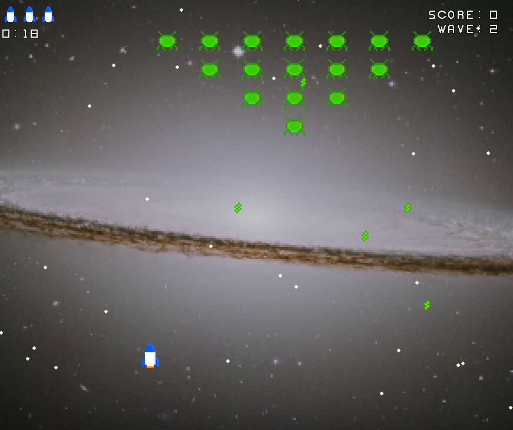
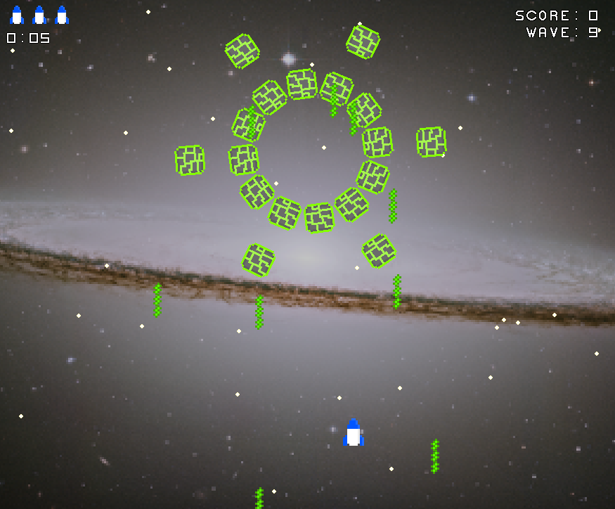
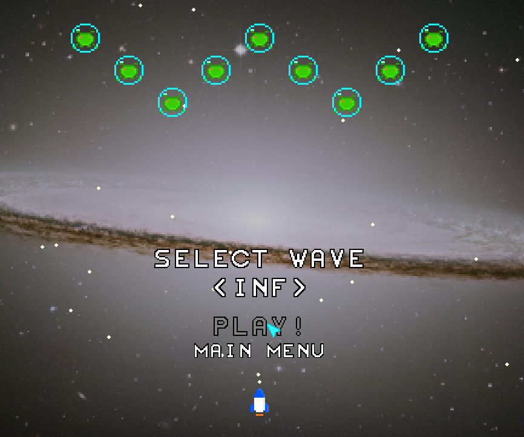

# Galaxy Invaders

This is a simple game that is sort of a Space Invaders / Galaga clone but the
enemies can be scripted using Lua. I made this just to test my knowledge
of the Lua programming language and if I can integrate it into a C program
(like a simple game).

There are 15 waves and a final boss fight along with a bunch of randomly
generated waves after that (though a lot of those are pretty much downright
unfair to play, be warned).

## Modding/Scripting the Game

If you do try modding the game, be warned that I did not include proper
error checking into this game as I mostly consider this a small demo
for me to experiment with the Lua Programming Language and its C API
but documentation will be included - you won't get any error messages
if something does go wrong.

NOTE: sometimes if you pass in a nil value to some functions it could
result in the game crashing so be careful of that.

### Documentation

TBA

## Build from source

You will need the following libraries installed on your system
to get the game to build:
- Lua ([website](https://www.lua.org))
- GLFW ([website](https://glfw.org))
- SOIL2 ([repo](https://github.com/SpartanJ/SOIL2))

### Linux:

```
cd galaxy_invaders
make
./galaxy_invaders
```

### Windows:

I used mingw-w64 to compile the game on Windows so you will be most
likely to get it to work with that.

```
cd galaxy_invaders
mingw32-make
.\galaxy_invaders
```

## Screenshots







## CREDITS

### Libraries Used:

Lua ([website](https://www.lua.org))

GLFW ([website](https://glfw.org))

glad ([website](https://glad.dav1d.de))

SOIL2 ([repo](https://github.com/SpartanJ/SOIL2))

### Images used:

background.png - "Sombrero Galaxy" [ Credit: STScI, NASA ](https://hubblesite.org/contents/media/images/3884-Image)
